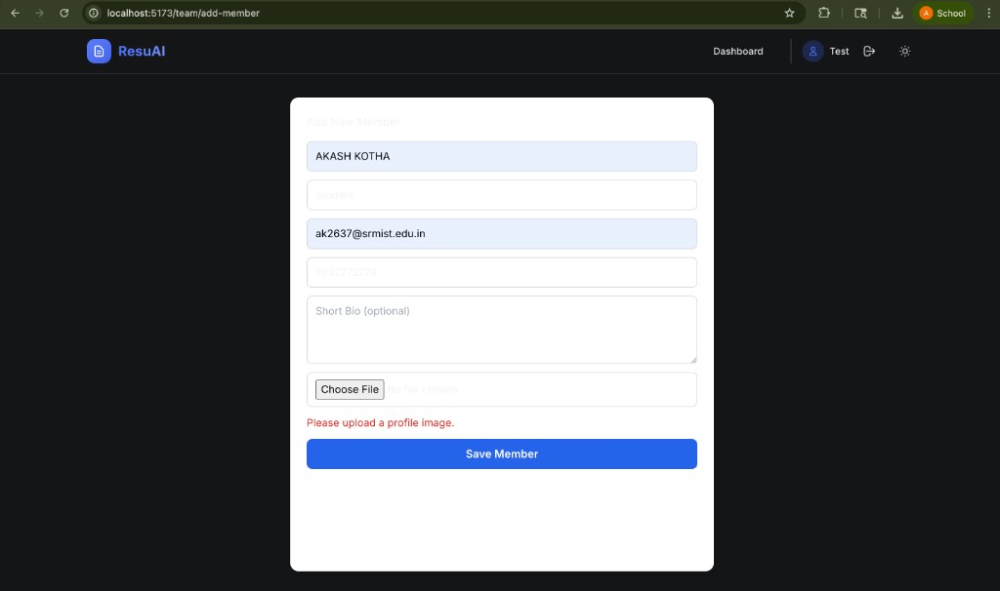
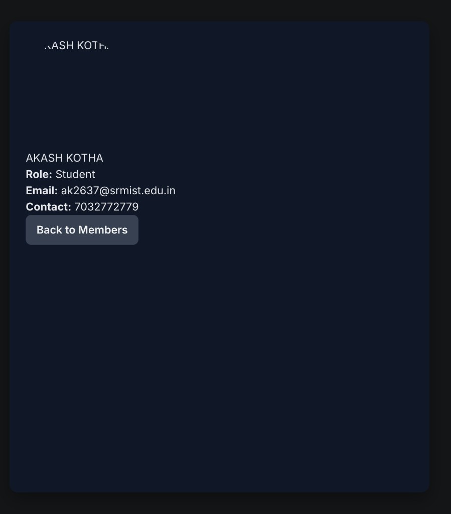
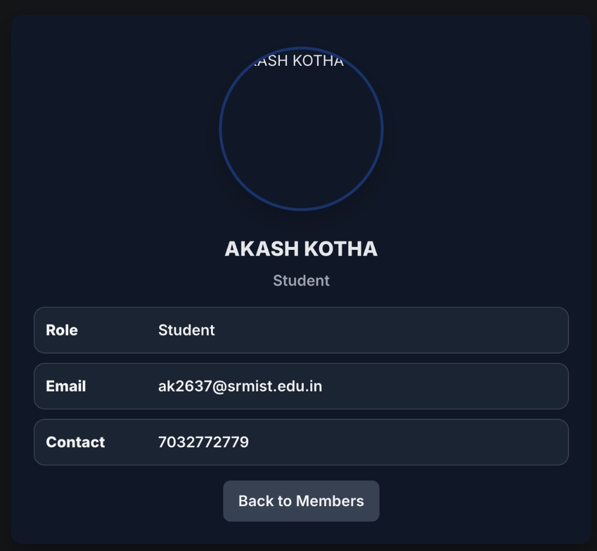

# Team 14 Project Submission

This repository contains a full-stack MERN application with:
- AI Resume Builder module
- Student Team Members Management module (CT2 task)

The app uses React + Vite on the frontend and Node.js + Express + MongoDB on the backend.

## Project Description

This project provides:
- User authentication (signup/login)
- Resume creation and editing features
- Team member management with image upload
- Member listing and member details pages

CT2-required pages are included:
- Home Page (`/team`)
- Add Member Page (`/team/add-member`)
- View Members Page (`/team/members`)
- Member Details Page (`/team/members/:id`)

## Installation Steps

1. Clone the repository:
```bash
git clone <your-repo-url>
cd Team-14
```

2. Install backend dependencies:
```bash
cd server
npm install
```

3. Install frontend dependencies:
```bash
cd ../client
npm install
```

4. Configure environment variables:
- Create `server/.env`
- Add required variables such as:
  - `PORT=5001`
  - `MONGO_URI=<your_mongodb_connection_string>`
  - `JWT_SECRET=<your_secret>`
  - `CLIENT_URL=http://localhost:5173`
  - `OPENAI_API_KEY=<your_key_if_used>`
  - `SMTP_HOST`, `SMTP_PORT`, `SMTP_USER`, `SMTP_PASS`, `SMTP_FROM`

### OTP Email Setup (Required for Login/Signup OTP)

Copy the template and edit values:

```bash
cd server
cp .env.example .env
```

Use either provider:

- **Mailtrap (recommended for testing):**
  - `SMTP_HOST=sandbox.smtp.mailtrap.io`
  - `SMTP_PORT=2525`
  - `SMTP_USER=<mailtrap_username>`
  - `SMTP_PASS=<mailtrap_password>`
  - `SMTP_FROM="ResuAI <no-reply@resuai.local>"`

- **Gmail (real inbox):**
  - Enable 2-step verification in Google account
  - Create an App Password
  - Set:
    - `SMTP_HOST=smtp.gmail.com`
    - `SMTP_PORT=587`
    - `SMTP_USER=<your_gmail>`
    - `SMTP_PASS=<your_app_password>`
    - `SMTP_FROM="ResuAI <your_gmail>"`

Set `ALLOW_DEV_OTP_FALLBACK=false` in `.env` to force real SMTP-only OTP delivery.

## API Endpoints

### Team Members APIs (CT2)
- `POST /api/members` -> Add a new member (multipart form-data with `image`)
- `GET /api/members` -> Get all members
- `GET /api/members/:id` -> Get one member by ID
- `PUT /api/members/:id` -> Update member/photo

### Existing APIs
- `GET /api/health` -> Health check
- `POST /api/auth/signup` -> Signup step 1 (send OTP)
- `POST /api/auth/signup/verify-otp` -> Signup step 2 (verify OTP + create session)
- `POST /api/auth/login` -> Login step 1 (send OTP)
- `POST /api/auth/login/verify-otp` -> Login step 2 (verify OTP + create session)
- Resume and AI routes are available under:
  - `/api/resumes`
  - `/api/ai`

### ATS Endpoint Functional Test (Authenticated)

You can run a live ATS endpoint test against an existing resume:

```bash
cd server
ATS_TEST_TOKEN=<jwt_token> ATS_TEST_RESUME_ID=<resume_id> npm run test:ats
```

Optional envs:
- `ATS_TEST_BASE_URL` (default: `http://localhost:5001/api`)
- `ATS_TEST_JOB_DESCRIPTION` (custom JD text for keyword matching)

## How To Run The App

Open 2 terminals:

Terminal 1 (Backend):
```bash
cd server
npm run dev
```

Terminal 2 (Frontend):
```bash
cd client
npm run dev
```

Then open:
- Frontend: `http://localhost:5173` (or the port shown by Vite)
- Backend: `http://localhost:5001`

## Screenshots

### Add Member Page


### Member Details (Initial)


### Member Details (Improved UI)


## Folder Structure

```text
Team-14/
├── client/
├── server/
├── screenshots/
├── .gitignore
└── README.md
```
